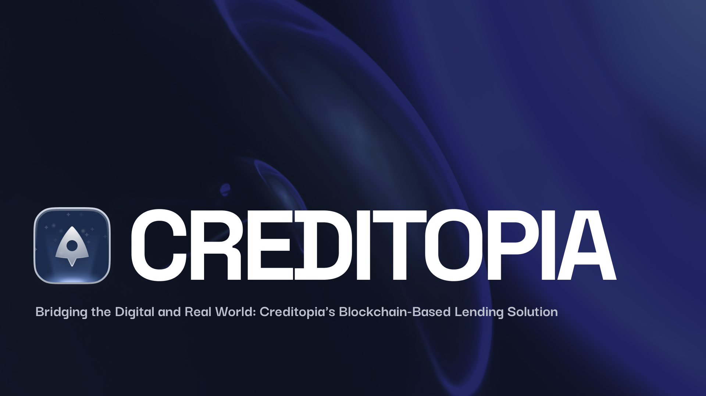
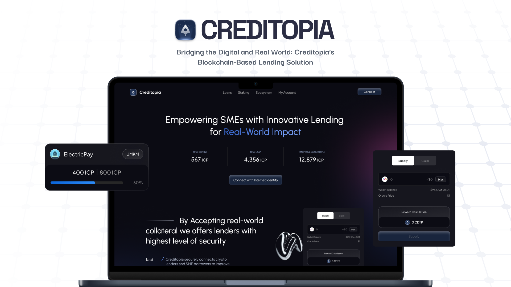

[![Contributors][contributors-shield]][contributors-url]  
[![Forks][forks-shield]][forks-url]  
[![Stargazers][stars-shield]][stars-url]  
[![Issues][issues-shield]][issues-url]  
[![MIT License][license-shield]][license-url]

<!-- PROJECT LOGO -->
<br />
<div align="center">
  <a href="https://github.com/Nafidinara/creditopia">
    
  </a>
  <h3 align="center">Creditopia - Empowering SMEs with Blockchain</h3>
  <p align="center">
    Creditopia is a P2P lending platform built on the Internet Computer Protocol (ICP) that connects SMEs with a global pool of lenders, offering secure, transparent, and efficient financing solutions.
    <br/>
    <br/>
    <a href="https://github.com/Nafidinara/creditopia">View Demo</a>
    ·
    <a href="https://github.com/Nafidinara/creditopia/issues">Report Bug</a>
    ·
    <a href="https://github.com/Nafidinara/creditopia/issues">Request Feature</a>
  </p>
</div>

## Why Creditopia?



### 1. Transparent and Secure Lending
Creditopia leverages blockchain technology to ensure complete transparency in lending processes, allowing both borrowers and lenders to track every step of the transaction on an immutable ledger.

### 2. Efficient Loan Processing
By utilizing smart contracts, Creditopia automates the loan disbursement process, reducing delays and ensuring funds are released as soon as conditions are met.

### 3. Global Access to Capital
SMEs can access a global pool of lenders, overcoming the limitations of traditional banking systems and finding more competitive loan terms.

### 4. Dual Benefits for Lenders
Lenders earn interest on loans and can also stake their cryptocurrency to earn additional rewards, maximizing their returns.

### 5. Simplified Borrowing for SMEs
The platform provides a user-friendly interface for SMEs to create loan requests with minimal paperwork, streamlining the borrowing process.

### 6. Integration with ICP and Cryptocurrency
Creditopia utilizes ICP for seamless operation and scalability, allowing transactions across borders without the restrictions of traditional currencies.

## Features, Amazing Creditopia Features That Leveraging ICP

### 1. Peer-to-Peer Lending: Empowering Borrowers and Lenders
Creditopia revolutionizes the lending process by using blockchain technology for total transparency, allowing both borrowers and lenders to monitor every transaction securely on an unchangeable ledger.

### 2. AI-On-Chain KYC: Safeguarding Lenders with Decentralized Data
Creditopia enhances security by employing AI-driven smart contracts for Know Your Customer (KYC) procedures, ensuring that lenders are protected while maintaining data decentralization.

### 3. Double Your Earnings: Stake Utility Tokens for Extra Rewards
Lenders can earn not just from interest on loans but also by staking their utility tokens, providing two avenues to maximize their financial returns.

### 4. Seamless Wallet Integration: Effortless Access with Plug Wallet
Creditopia simplifies the lending experience by allowing users to log in and manage their funds easily with Plug Wallet, streamlining transactions within the ecosystem.


## Technologies Used
- **Internet Computer Protocol** (ICP)
- **Rust** for AI-On-Chain KYC
- **ICRC1** for Staking Token Mechanism
- **Vue.js** for Frontend
- **Motoko** for Backend
- **Plug Wallet** Integration

## Getting Started

1. Clone the repository:
   ```sh
   git clone https://github.com/Nafidinara/creditopia.git .
   ```
2. Go To INSTALLATION.MD:
   Follow all the instruction on the INSTALLATION.MD file

## Demo App

| Screenshot 1                       | Screenshot 2                       |
| ---------------------------------- | ---------------------------------- |
|  |  |

## License
Distributed under the MIT License. See `LICENSE.txt` for more information.

## Created by Ulti Nolan Team
- Orang 1 (Developer)
- Orang 1 (Developer)
- Orang 1 (Developer)
- Orang 1 (Developer)
- Orang 1 (Developer)

<!-- MARKDOWN LINKS & IMAGES -->
[contributors-shield]: https://img.shields.io/github/contributors/Nafidinara/creditopia.svg?style=for-the-badge
[contributors-url]: https://github.com/Nafidinara/creditopia/graphs/contributors
[forks-shield]: https://img.shields.io/github/forks/Nafidinara/creditopia.svg?style=for-the-badge
[forks-url]: https://github.com/Nafidinara/creditopia/network/members
[stars-shield]: https://img.shields.io/github/stars/Nafidinara/creditopia.svg?style=for-the-badge
[stars-url]: https://github.com/Nafidinara/creditopia/stargazers
[issues-shield]: https://img.shields.io/github/issues/Nafidinara/creditopia.svg?style=for-the-badge
[issues-url]: https://github.com/Nafidinara/creditopia/issues
[license-shield]: https://img.shields.io/github/license/Nafidinara/creditopia.svg?style=for-the-badge
[license-url]: https://github.com/Nafidinara/creditopia/blob/main/LICENSE.txt
